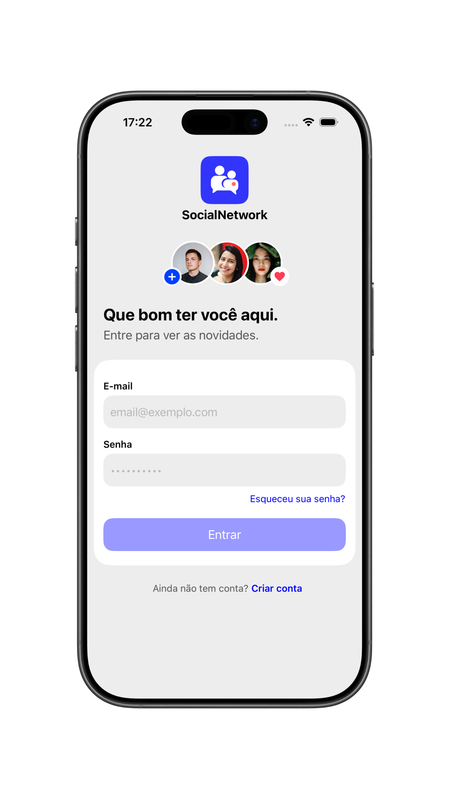
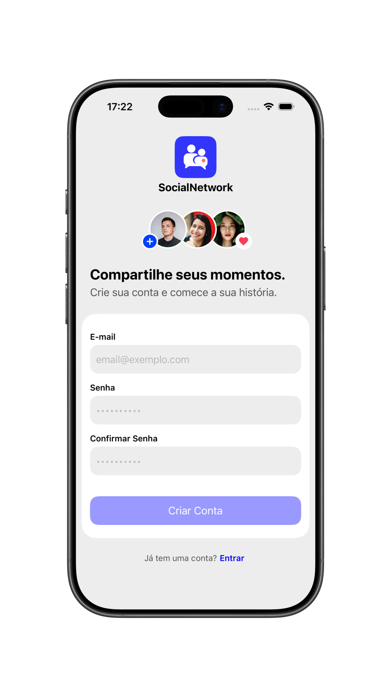
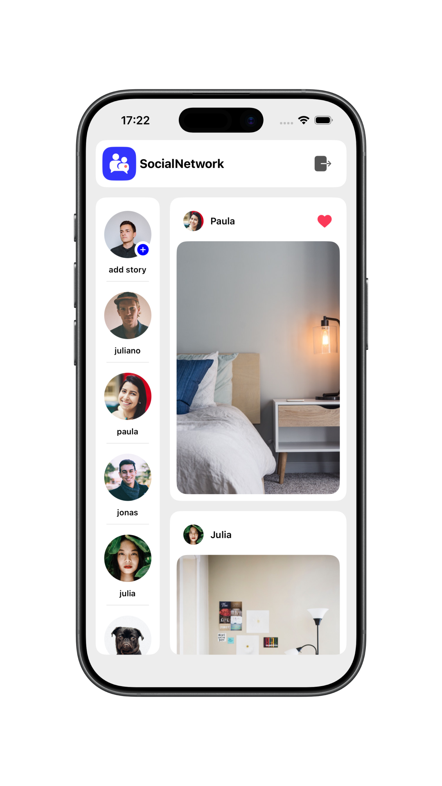
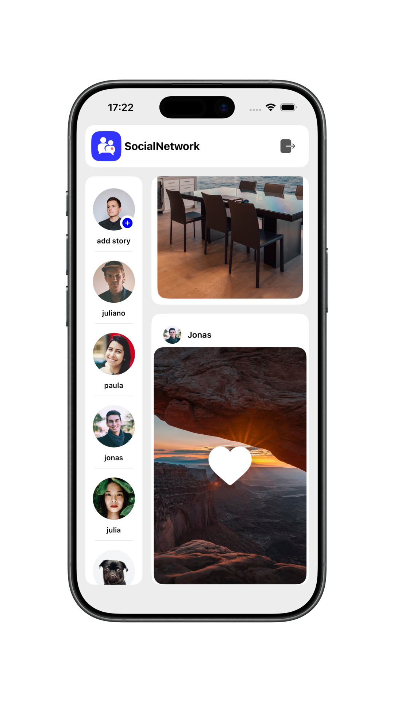

<div align="center">
  

  # SocialNetwork

  Um aplicativo iOS para explorar stories e publicações em uma rede social.

  [](https://www.swift.org/)
  [](https://developer.apple.com/documentation/uikit)
  [](#arquitetura)
</div>

## 📱 Sobre o projeto

O **SocialNetwork** é um aplicativo iOS com cadastro e login por e-mail e senha. Depois de entrar, o usuário encontra uma tela inicial com stories e publicações, pode interagir com a animação de curtida por toque duplo em uma imagem e encerrar a sessão.

O projeto foi desenvolvido em **Swift**, com **UIKit em View Code** e organização **MVVM**. O **Firebase Authentication** cuida das contas, e o **Firebase Crashlytics** está configurado para coletar relatórios de falhas. Os dados exibidos na home são carregados de um JSON remoto por `URLSession`; o projeto também contém alternativas com Alamofire e um JSON local.

## 🖼️ Demonstração

<p align="center">
  
  
  
  
</p>

## ✨ Funcionalidades

- Cadastro e login com e-mail e senha pelo Firebase Authentication
- Validação dos campos de e-mail e senha
- Visualização de stories e publicações na tela inicial
- Animação de curtida ao tocar duas vezes na imagem de uma publicação
- Encerramento da sessão
- Carregamento dos dados da home por `URLSession`, com opções de Alamofire e JSON local no código
- Relatórios de falhas com Firebase Crashlytics

> A curtida é apenas visual: ela não é salva em um servidor. A recuperação de senha e a criação de stories ainda exibem avisos de funcionalidade futura.

## 🛠️ Tecnologias

| Tecnologia | Uso no projeto |
| --- | --- |
| Swift 5 | Linguagem principal |
| UIKit + View Code | Construção das interfaces |
| MVVM | Organização das telas e suas regras |
| Firebase Authentication | Cadastro, login e logout |
| Firebase Crashlytics | Coleta de relatórios de falhas |
| URLSession | Busca dos dados da home no JSON remoto usado pelo app |
| Alamofire | Alternativa de requisição HTTP disponível no serviço |
| Swift Package Manager | Gerenciamento das dependências |

<a id="arquitetura"></a>

## 🏗️ Arquitetura

O código está organizado por fluxo. As telas de login, cadastro e home possuem `Screen`, `ViewController` e `ViewModel`. Modelos, serviços, recursos e extensões ficam em pastas compartilhadas.

```text
SocialNetwork/
├── App/             # Inicialização e ciclo de vida
├── Features/        # Login, cadastro, home e componentes das células
├── Model/           # Modelos dos stories e posts
├── Service/         # Carregamento dos dados da home
├── Json/            # Dados locais para desenvolvimento
├── Resources/       # Ícone, imagens e demais recursos
└── Utils/           # Componentes e extensões compartilhadas
```

Na home, o fluxo de dados é:

```text
Screen → ViewController ⇄ ViewModel → HomeService → JSON remoto / JSON local
```

## 🚀 Como executar

1. Clone o repositório:

   ```bash
   git clone https://github.com/julianosgarbossa/SocialNetwork.git
   cd SocialNetwork
   ```

2. Crie seu próprio projeto no [Firebase Console](https://console.firebase.google.com/) e adicione um app iOS com o **Bundle ID** `br.com.julianosgarbossa.SocialNetwork`. Se alterar esse identificador no Xcode, use o mesmo identificador ao registrar o app no Firebase.

3. Em **Authentication → Sign-in method**, habilite o provedor **E-mail/senha**. Você poderá criar uma conta pela tela **Criar conta** do aplicativo; não é necessário cadastrar um usuário manualmente no console.

4. Baixe o `GoogleService-Info.plist` do seu app iOS no Firebase e coloque-o em `SocialNetwork/GoogleService-Info.plist`. Confira no Xcode se o arquivo pertence ao target **SocialNetwork** e é incluído no bundle do aplicativo.

5. Abra `SocialNetwork.xcodeproj` no Xcode. Aguarde a resolução das dependências pelo Swift Package Manager, selecione um simulador compatível e execute com `⌘R`.

6. Na primeira execução, toque em **Criar conta**, informe um e-mail e uma senha e, após o cadastro, volte à tela de login para entrar.

O projeto está configurado com **iOS 26.5** como versão mínima e foi criado com **Xcode 26.6**. A tela inicial usa um JSON remoto, então precisa de conexão à internet. Para experimentar os dados locais, altere a chamada em `HomeViewController` de `.urlSession` para `.mock`.

O `GoogleService-Info.plist` é específico de cada projeto Firebase e já está no `.gitignore`; mantenha seu arquivo apenas no ambiente local. O projeto também inclui a dependência e o script de build do **Firebase Crashlytics** para envio de símbolos de depuração ao Firebase.
